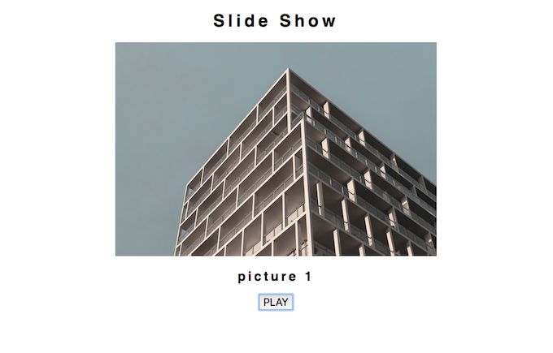

# チャレンジ9

```
所要時間: 45分
ステータス:
タイプ:
```

## 目的

- 関数を作って再生停止機能を持ったスライドショーを作る
- 作成した関数をコールバック関数として使う


## チャレンジの取り組み方

1. マイルストーンごとに要件に合うようにファイルを編集していきます。
2. 分からない部分があれば、テキストを復習して、再度チャレンジしてみましょう。
3. 再チャレンジしてしばらく考えても分からない場合はチャットでメンターに質問しましょう。
4. 完成したら、Dropboxでメンターとファイルを共有して下さい。
5. メンターから課題レビューが届きます。
6. ビデオチャットの際は、分からない点を更に突っ込んで聞いたり、より良い書き方を聞いてみましょう。

## 概要
ブラウザ上の再生ボタンを押すことで2秒ごとに6枚の写真が切り替わるスライドショーを作りましょう。以下の3つの関数を使用することにします。
1. `画像を切り替える関数：changePicture`
2. `画像の再生停止機能をもった関数：playSlidedeshow`
3. `一定時間で関数を呼び出すタイマー処理の関数：setInterval`

3の`setInterval`はJavaScript側で用意されているので、1と2の関数を作ることにします。2のスライドショー再生のための関数を実行すると3のタイマー処理が実行され、一定間隔で1の関数が呼び出されることでスライドショーが実装できます。

また以下のように、再生中であるか停止中であるかを判定してボタンの表示を変更しましょう。
### 停止時のボタン表示

### 再生時のボタン表示


## スターターファイル

自分のパソコン上に、challenge9というフォルダを作って、その中に`index.html`、 `styles.css` 、 `script.js` というファイルをそれぞれ作成しましょう。それぞれのファイルには以下のスターターファイルの内容をコピーして下さい。

[codegrit-js-unit01-ch09-starter](https://github.com/codegrit-jp-students/codegrit-js-unit01-ch09-starter)

 使用しているフリー画像の提供元
- [unsplash](https://unsplash.com)

## マイルストーン１

### 要件
1. ブラウザに写真と画像のタイトルを表示させるために、`タグのsrc属性の値`および、`<h2>タグで表示させる画像タイトルの文字列`をプロパティに設定したオブジェクトを用意します。
各オブジェクトは例えば以下のようにします。ここでは`src`は画像のリンク先、`title`はブラウザに表示させる画像タイトルを表します。
```js
//画像情報のオブジェクトの例
{src: './images/pic_1.jpg', title: 'picture 1'}
```
そして、これを要素とした配列を作成しましょう。以下はその例です。リンク先が正しく参照できているか注意してください。
```js
//画像情報のオブジェクトを格納した配列の例
const picArray = [
{src: './images/pic_1.jpg', title: 'picture 1'},
{src: './images/pic_2.jpg', title: 'picture 2'},
{src: './images/pic_3.jpg', title: 'picture 3'},
{src: './images/pic_4.jpg', title: 'picture 4'},
{src: './images/pic_5.jpg', title: 'picture 5'},
{src: './images/pic_6.jpg', title: 'picture 6'}
];
```

2. 画像を切り替える関数`changePicture`を作成しましょう。
  - この関数は`コールバック関数`となり、タイマー`setInterval`の引数として渡されることになります。この`changePicture`が2秒間隔で呼ばれる度に、1で作成した配列内に格納されたオブジェクトを順番に取り出してhtml要素に反映させる機能があればスライドショーが実装できます。
  - `if文`を使い、関数changePictureが呼ばれるたびに異なった結果を返す機能を実装して下さい。
  - オブジェクトの値をhtmlに反映させるには、以下の`src`、`innerHTML`プロパティに値を代入します。

  ```js
  //このプロパティに配列に格納しているsrcを代入する
  document.getElementById('pics').src
  //このプロパティに配列に格納しているtitleを代入する
  document.getElementById('pic-title').innerHTML
  ```
  配列要素のオブジェクトから値を取得するには、以下のように配列のインデックスの値とプロパティ名を指定することで取り出せます。
  ```js
  //画像タイトルを取得
  picArray[0].title
  ```

3. `id="playButton"`のボタン要素をクリックすることでスライドショーを開始する関数`playSlidedeshow`を作成しましょう。
  - 再生にはタイマー処理をする関数`setInterval(引数1,引数2)`を使います。引数1に画像を切り替えるための関数入れ、引数2には実行間隔の値2000(ミリ秒)を設定します。

  ```js
  setInterval(changePicture,2000);
  ```

  - スライドショーが再生中かどうかを記録しておくためのグローバル変数`playingID`を作成します。この変数に実行する`setInterval`を代入すると現在実行しているタイマーのタイマーIDが格納されます。

  ```js
  //戻り値のタイマーIDが代入される
  playingID = setInterval(changePicture,2000);
  ```

  - タイマーを停止させるには`clearInterval(引数)`を使います。引数にタイマーIDを入れることで、実行中のタイマーが停止します。

  ```js
  //停止処理
  clearInterval(playingID);
  ```
  - `if文`を使い、ボタンを押すごとに再生、停止を切り替える機能を実装してください。再生時にはボタンの表示を「STOP」とし、停止時には「PLAY」を表示させて下さい。


## 評価

課題の後、以下の２つについてメンターにフィードバックをお願いします。

1. 要件のカバー度: 1.全く出来なかった 2.ほとんど出来なかった 3. 半分ほどは出来た 4.8割ほどは出来た 5. 全部出来た
2. 難易度: 1. とても難しかった 2. 難しかった 3. ちょうど良かった 4. 簡単だった 5. とても簡単だった
